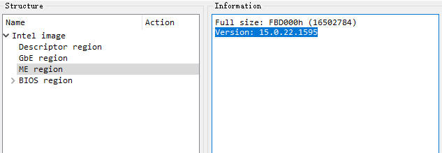
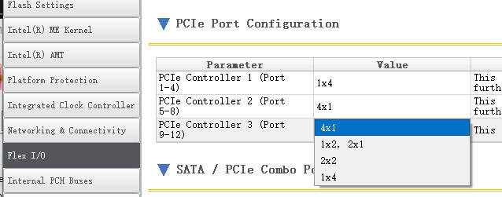
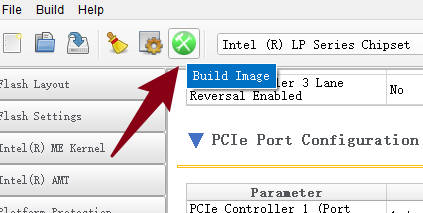

# LenovoTinyBIOS
Lenovo Tiny Series BIOS

联想Tiny系列BIOS收集以及BIOS查看修改工具

# 修改南桥PCIE拆分的方法

### 1、备份出BIOS

使用编程器，将主板的BIOS读取出来，如果是2颗Flash芯片，则都需要读取。

### 2、查看ME版本号

使用UEFItool，打开备份出的BIOS，然后选择 Intel image-->ME region
在右侧即可显示出当前BIOS的ME的版本号

### 3、下载工具

上面知道了ME版本号，则需要下载对应版本的工具。

https://comsystem-tlt.ru/obzori/me-txe-region

https://mega.nz/folder/qdVAyDSB#FLCPaDVIsPYiy2TAUjD7RQ

### 4、打开FIT工具

解压下载的工具，打开 Flash Image Tool-->fit.exe

然后使用工具，打开备份的BIOS，如果报错，那就是备份的BIOS有问题。

### 5、修改南桥拆分

选择左侧的Flex I/O，然后右侧下拉到PCIe Port Configuration即可开始修改拆分了。

南桥PCIE这块，4条lane为一组，你可以修改为4个x1、2个x2、1个x4

找到你要修改的端口进行修改就行，如果不知道，就盲猜试试看。

### 6、编译BIOS

修改完毕后，点击上方的Buid Image即可，最后会在工具的目录下生成 outimage.bin

### 7、输入验证

将生成好的BIOS刷回去，看看搞对了没。没搞对，那就再修改试试。